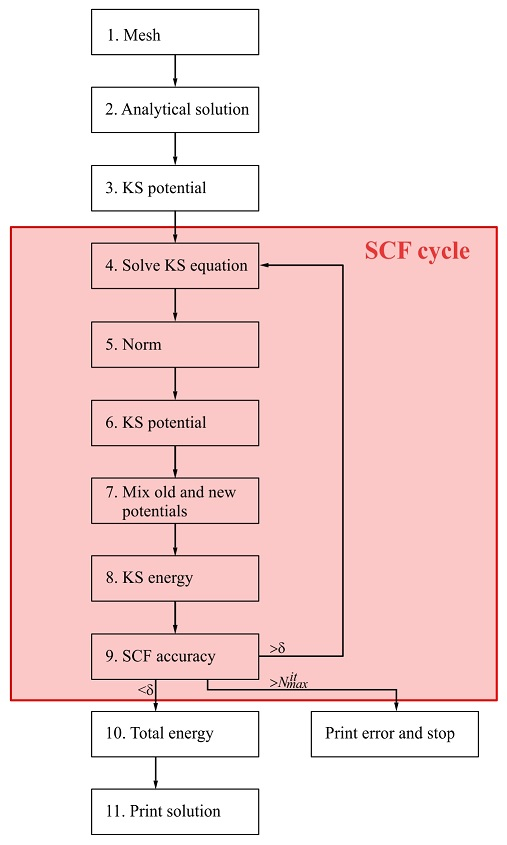
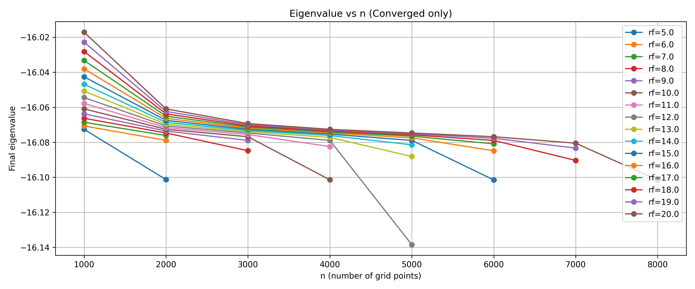
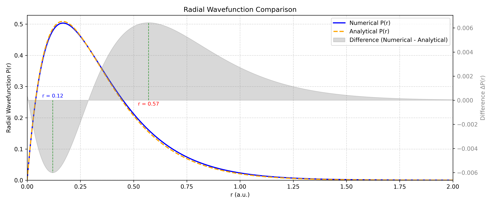
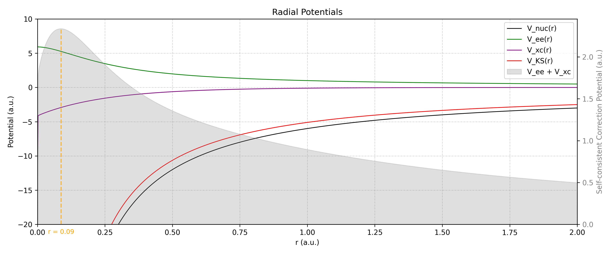

# Radial Kohn-Sham Equation Solver for Hydrogen-like Atoms

**Author:** Wang Jianghai @Nanyang Technological University

**Date:** 2025-10-24

---

## Table of Contents

- [Abstract](#abstract)
- [1. Density Functional Theory](#1-density-functional-theory)
  - [1.1 Adiabatic and Single-Electron Approximations](#11-adiabatic-and-single-electron-approximations)
  - [1.2 Thomas–Fermi–Dirac Approximation](#12-thomas–fermi–dirac-approximation)
  - [1.3 Hohenberg–Kohn Theorems](#13-hohenberg–kohn-theorems)
  - [1.4 Radial Kohn-Sham Equations](#14-radial-kohn-sham-equations)
  - [1.5 Exchange–Correlation Functionals](#15-exchange–correlation-functionals)
    - [1.5.1 Local Density Approximation (LDA)](#151-local-density-approximation-lda)
    - [1.5.2 Generalized Gradient Approximation (GGA)](#152-generalized-gradient-approximation-gga)
    - [1.5.3 Hybrid Functionals](#153-hybrid-functionals)
  - [1.6 Software for DFT](#16-software-for-dft)
- [2. Implementation](#2-implementation)
  - [2.1 Discretization](#21-discretization)
  - [2.2 Analytical Solution](#22-analytical-solution)
  - [2.3 Numerov Method](#23-numerov-method)
  - [2.4 Thomas Algorithm](#24-thomas-algorithm)
  - [2.5 Self-Consistent Field](#25-self-consistent-field)
  - [2.6 Exchange-Correlation Functional](#26-exchange-correlation-functional)
  - [2.7 Code Details](#27-code-details)
- [3. Usage](#3-usage)
- [4. Discussion](#4-discussion)
  - [4.1 Optimization of DFT Parameters](#41-optimization-of-dft-parameters)
    - [4.1.1 Optimization of Integration Parameters](#411-optimization-of-integration-parameters)
    - [4.1.2 Mixing Parameter for SCF Convergence](#412-mixing-parameter-for-scf-convergence)
  - [4.2 Final radial P(r) and potential — observations](#42-final-radial-wavefunction-and-potential)
  - [4.3 Known Numerical Issues](#43-known-numerical-issues)
  - [4.4 Theoretical Extensions](#44-theoretical-extensions)
- [5. Conclusion](#5-conclusion)
- [6. References](#6-references)

---

<div id="abstract" style="border:1px solid #d0d7de; padding:16px; background:#e6ffef; border-radius:6px;">
<strong style="font-size:1.05em;">Abstract</strong>

<p style="margin-top:0.5em;">
This project implements a radial Kohn–Sham (KS) self-consistent field (SCF) solver for spherically symmetric (H-like) systems, focusing on the 1s orbital. The solver uses a fixed radial mesh, constructs the Kohn–Sham potential as
</p>

$$
V_{\text{KS}}(r) = V_{\text{nuc}}(r) + V_{\text{ee}}(r) + V_{\text{xc}}(r),
$$

<p>
solves the radial KS differential equation with Numerov/Thomas tridiagonal propagation, computes energy components, and iterates until the KS eigenvalue ($\varepsilon$) converges. Exchange-correlation is handled in a local density approximation (LDA) with an analytic parameterization. The implementation is pedagogical and suitable for learning numerical Density Functional Theory (DFT) methods and numerical ordinary differential equation (ODE) solvers (Numerov and Thomas algorithms) in spherical coordinates.
</p>
</div>

# 1. Density Functional Theory
Following the establishment of quantum mechanics and statistical physics, theoretical studies of condensed matter gradually emerged. It became clear that the macroscopic properties of solids are intrinsically linked to their electronic behavior. In principle, if one could exactly solve the electronic wave functions in a solid, all physical quantities of the system could be obtained through the corresponding quantum-mechanical operators. However, a typical solid contains on the order of $10^{23}$ particles, each with three spatial degrees of freedom, making the many-body Hamiltonian intractably complex and analytically unsolvable. Hence, appropriate approximations are essential.

Density Functional Theory is a quantum mechanical modeling method used in physics, chemistry, and materials science to investigate the electronic structure of many-body systems. The fundamental principle of DFT is that the properties of a many-electron system can be determined using functionals of the spatially-dependent electron density rather than the many-body wavefunction, reducing the problem from a $3N$-dimensional space to only three dimensions. This fundamental reformulation significantly simplifies the calculation of electronic structure while retaining quantum-mechanical accuracy.

## 1.1 Adiabatic and Single-Electron Approximations
Because the mass of a nucleus is roughly 1800 times that of an electron, electrons respond much more rapidly to environmental changes than nuclei do. Thus, the physical problem can be decoupled into two parts: when describing electronic motion, the nuclei can be treated as fixed sources of potential, whereas when describing nuclear motion, the electronic distribution can be considered static. Solving the electronic problem under a fixed nuclear potential yields the lowest-energy configuration, i.e., the electronic ground state.

This separation of electronic and nuclear motion forms the basis of the Born–Oppenheimer approximation, or the adiabatic approximation. It reduces the full many-body problem to a purely electronic one, with the ground-state energy $E(R_1, R_2, ..., R_M)$ depending on the nuclear positions {$R_i$}, thereby defining the adiabatic potential energy surface of the system.

Even after separating nuclear and electronic motion, the electron–electron interaction remains a many-body problem involving $N$ particles. To address this, Hartree proposed averaging the instantaneous interactions between electrons, treating each electron as moving independently in an averaged potential—the Hartree approximation, or single-electron approximation. Although this simplification transformed the many-electron problem into a set of single-electron equations, it neglected electron exchange and correlation effects. Fock later incorporated the exchange interaction, leading to the Hartree–Fock approximation. While Hartree–Fock theory accurately accounts for exchange, it still neglects correlation effects, and its accuracy deteriorates with increasing electron number.

## 1.2 Thomas–Fermi–Dirac Approximation
In 1927, Thomas and Fermi proposed the homogeneous electron gas model, which neglects electron–electron interactions and expresses the total energy as a functional of electron density. In 1930, Dirac introduced a local approximation for exchange interactions, extending the model to account for exchange energy within the density functional framework. The combined formulation is known as the Thomas–Fermi–Dirac (TFD) approximation.

## 1.3 Hohenberg–Kohn Theorems
The theoretical foundation of modern DFT lies in two theorems proved by Hohenberg and Kohn.

1. The ground-state properties of a many-electron system are uniquely determined by the electron density $n(\mathbf{r})$.
2. The electron density that minimizes the energy of the overall functional is the ground-state electron density.

The energy functional can be expressed as:
$$
E[\psi_i] = -\frac{\hbar^2}{m}\int \psi_i^* \nabla^2 \psi_i d^3r + \int V(\mathbf{r}) n(\mathbf{r}) d^3r + \frac{e^2}{2}\iint \frac{n(\mathbf{r}) n(\mathbf{r'})}{|\mathbf{r}-\mathbf{r'}|} d^3r d^3r' + E_{\text{ion}} + E_{\text{XC}}[\psi_i]
$$

which contains the kinetic energy of electrons, electron–nucleus Coulomb interaction, electron–electron Coulomb repulsion, and nucleus–nucleus repulsion. The remaining term, $E_{\text{XC}}[\psi_i]$, is the exchange-correlation energy functional, which accounts for the complex many-body effects of exchange and correlation among electrons.
## 1.4 Radial Kohn-Sham Equations

In practice, DFT calculations are performed using the Kohn-Sham approach, which replaces the original many-body problem by an auxiliary independent-particle problem.

Starting from the three-dimensional Schrödinger equation in spherical coordinates:

$$\Psi \left( {r,\theta ,\varphi } \right) = \Psi \left( r \right)Y\left( {\theta ,\varphi } \right)$$

where $Y( {\theta ,\varphi })$ is spherical harmonics. It can be separated on two independent equations for $r$ and $\theta ,\varphi$. The Schrodinger equation in spherical coordinates for part depending on $r$ only, the **radial Schrodinger equation** is

$$\left[-\frac{1}{2r}\frac{d^2}{dr^2}r + \frac{l(l+1)}{2r^2} + V_\text{nuc}(r)\right]\Psi_{nl}(r) = E_{nl}\Psi_{nl}(r)$$

where $V^{NUC}(r)=-\frac{Z}{r}$. For the ground state (1s orbital) with $n=1$, $l=0$, the centrifugal term vanishes, resulting in:

$$\left[-\frac{1}{2}\frac{d^2}{dr^2} + V_\text{nuc}(r)\right]\Psi_{1s}(r) = E\Psi_{1s}(r)$$

For atoms with spherical symmetry, we can separate the wavefunction into radial and angular parts:

$$\psi_{nlm}(\mathbf{r}) = \frac{P_{nl}(r)}{r} Y_{lm}(\theta, \phi)$$

where $Y_{lm}$ are spherical harmonics and $P_{nl}(r)$ is the radial wavefunction.

Then the radial Kohn-Sham equation can be written as:

$$\left[-\frac{1}{2}\frac{d^2}{dr^2} + \frac{l(l+1)}{2r^2}+V_\text{KS}(r)\right]P_{nl}(r) = \varepsilon_{nl}P_{nl}(r)$$

where $P_{nl}(r)=r\Psi_{nl}(r)$ is the radial wave function, $V_{\text{KS}}(\mathbf{r})$ is the Kohn-Sham potential, given by:

$$V_{\text{KS}}(\mathbf{r}) = V_\text{nuc}(r) + V_{ee}(r) + V_{xc}(r)$$

comprising the nuclear attraction potential

$$V_\text{nuc}(r)=-\frac{Z}{r}$$

the electron-electron Coulomb repulsion potential

$${V^{ee}}\left( r \right) = 4\pi \int {{{\rho \left( {r'} \right)} \over {\left| {r - r'} \right|}}} {r'^2}dr'$$

and the exchange-correlation potential $V_{\text{xc}}$.

For the ground state (1s orbital, with $l=0$), the radial Kohn-Sham equation becomes:

$$\left[ -\frac{1}{2}\frac{d^2}{dr^2} + V_{{KS}}(r) \right] P_{10}(r) = \varepsilon_{10}P_{10}(r)$$

This is the equation we solve numerically in this implementation.

## 1.5 Exchange–Correlation Functionals
The key unknown in DFT is the exchange-correlation functional $E_{XC}[\rho]$. While the Hohenberg–Kohn theorems guarantee its existence, its explicit form cannot be derived, and therefore various approximations are employed in practical calculations. The choice of an appropriate XC functional is crucial, as it directly determines both the accuracy and computational efficiency of DFT.

### 1.5.1 Local Density Approximation (LDA)
LDA assumes that the exchange–correlation energy at each point depends only on the local electron density, as in a uniform electron gas:
$$
V_{XC}(\mathbf{r}) = V_{XC}^{\text{electron gas}}[n(\mathbf{r})]
$$

Although this approximation neglects spatial variations in the density, it provides a tractable and often surprisingly effective method, especially for systems with slowly varying densities. However, it becomes inaccurate for systems with strong density gradients, such as covalently bonded materials.

### 1.5.2 Generalized Gradient Approximation (GGA)
GGA extends LDA by incorporating not only the local electron density but also its spatial gradient, making $E_{XC}$ a functional of both $n(\mathbf{r})$ and $\nabla n(\mathbf{r})$.
$$E_{XC}^{\text{GGA}} = E_{XC}[n(\mathbf{r}), \nabla n(\mathbf{r})]$$
This inclusion of local inhomogeneity typically improves accuracy over LDA. Common GGA functionals include **Perdew–Wang (PW91)** and **Perdew–Burke–Ernzerhof (PBE)**, both widely adopted in solid-state calculations.

### 1.5.3 Hybrid Functionals
Hybrid functionals combine the orbital-dependent Hartree–Fock exchange with density-based functionals, controlled by a mixing parameter $\lambda$. For instance, when $\lambda=0$, the exchange is purely Hartree–Fock; when $\lambda=1$, it is entirely LDA or GGA. The **Heyd–Scuseria–Ernzerhof (HSE)** hybrid functional, particularly **HSE06**, mixes 25% of short-range Hartree–Fock exchange with 75% of short-range PBE exchange, while using PBE for correlation and long-range exchange:
$$
E_{XC}^{\text{HSE06}} = \frac{1}{4}E_X^{\text{SR,HF}}(\mu) + \frac{3}{4}E_X^{\text{SR,PBE}}(\mu) + E_X^{\text{LR,PBE}}(\mu) + E_C^{\text{PBE}}
$$
Hybrid functionals often provide improved band-gap predictions and better descriptions of strongly correlated systems, though at significantly higher computational cost and with sensitivity to empirical parameters.

<div id="note" style="border:1px solid #d0d7de; padding:16px; background:#fcffd2; border-radius:6px;">
<strong style="font-size:1.05em;">Self-Interaction Error</strong>

<p style="margin-top:0.5em;">
A fundamental limitation inherent to approximate DFT functionals is the self-interaction error (SIE). In principle, the exact exchange–correlation potential should cancel the spurious Coulomb interaction of an electron with itself. However, approximate functionals do not fully achieve this cancellation, leading to a residual and unphysical electron self-interaction.
</p>

<p>
As a result, DFT often exhibits several systematic deficiencies. First, it tends to overstabilize delocalized electronic states, leading to an underestimation of band gaps in semiconductors and insulators; Second, it underpredicts chemical reaction barriers, as transition states with stretched bonds are artificially stabilized; Finally, the highest occupied Kohn–Sham (KS) eigenvalue no longer corresponds to the true ionization potential, violating Koopmans’ theorem.
</p>

<p>
To mitigate SIE, various self-interaction correction (SIC) schemes have been developed, aiming to remove the spurious self-Coulomb energy from each occupied orbital. Alternatively, more sophisticated many-body approaches, such as the GW approximation or Møller–Plesset perturbation theory (MPn), can be employed to provide more accurate electronic structures by explicitly accounting for electron correlation beyond standard DFT.
</p>

</div>

## 1.6 Software for DFT
Several software packages implement DFT calculations (see [Wikipedia](https://en.wikipedia.org/wiki/List_of_quantum_chemistry_and_solid-state_physics_software)), including:
- **[VASP](https://www.vasp.at/)**: A software for atomic scale materials modelling from first principles.
- **[Quantum ESPRESSO](https://www.quantum-espresso.org/)**: An integrated suite of Open-Source computer codes for electronic-structure calculations and materials modeling at the nanoscale.
- **[ABINIT](https://www.abinit.org/)**: A software suite to calculate the optical, mechanical, vibrational, and other observable properties of materials.
- **[Gaussian](https://gaussian.com/)**: A powerful and versatile software for modeling molecules and chemical problems.
- **[ABACUS](https://abacus.ustc.edu.cn/main.htm)**: A software package for large-scale electronic structure calculations from first principles.


# 2. Implementation

## 2.1 Discretization

The radial equation is discretized using a uniform grid:

$$r_i = r_0 + i \cdot h, \quad i = 0, 1, ..., N-1$$

where $r_0$ is the starting point (close to the origin to avoid singularities), $h$ is the step size, and $N$ is the number of grid points.

The selection of the inner and outer radial cutoffs, $r_0$ and $r_f$, is crucial for stable and accurate numerical solutions. The inner cutoff $r_0 > 0$ avoids the Coulomb singularity in terms such as $-\frac Zr$ or $\rho(r) = \frac{P(r)}{r}$ and prevents division by zero that can amplify round-off errors. The outer boundary $r_f$ must be sufficiently large so that the tail of the physical wavefunction is negligible, ensuring that truncation errors remain well below the target tolerance.

For the inner cutoff $r_0$, one should choose the smallest positive value that simultaneously (i) keeps $-\frac Z{r_0}$ within the floating-point range, and (ii) resolves the near-origin analytic behavior $P(r) \propto r^{l+1}$. A practical guideline is $r_0 \lesssim h$, typically in the range $10^{-6}\sim 10^{-4}$ a.u. Choosing $r_0$ too small can lead to catastrophic cancellation in $\frac{P(r)}r$ and significant Hartree/exchange-correlation noise.

The outer boundary $r_f$ should be chosen such that $\frac{|P(r_f)|}{\max_r |P(r)|} \ll 10^{-6}$. For a hydrogenic $1s$ orbital, $P(r) \sim r e^{-Zr}$; requiring $e^{-Z r_f} < 10^{-12}$ gives $r_f > \frac{12 \ln 10}Z \approx \frac{27.6}Z$. In practice, $r_f = 10 \sim 20$ a.u. suffices for $Z=1$, with larger $Z$ values reducing the required radius roughly in proportion to $\frac1Z$.

Once $(r_0, r_f)$ are fixed, the number of grid points $N$ should be selected so that the mesh spacing $h = \frac{r_f - r_0}{N-1}$ adequately resolves (i) the fastest spatial variations near the nucleus, characterized by the length scale $\frac{a_0}Z$, and (ii) regions where diagnostic errors may appear. Typically, $h \lesssim 0.01\sim 0.02$ a.u. ensures smooth convergence for a single-orbital case.

Advanced improvements include using logarithmic or mixed (piecewise) grids to concentrate points near $r=0$ without excessively increasing $N$, asymptotic matching to replace the outer tail, or mapped coordinates (e.g., $r = f(x)$ with $x \in [0,1]$) to equalize numerical error distribution.

In this project, the choices $r_0 = 10^{-5}$ a.u., $r_f = 20$ a.u., and $N = 10001$ yield $h \approx 0.002$ a.u. with negligible tail contribution.

## 2.2 Analytical Solution

The implementation is based on the hydrogen-like atom model, which has an exact analytical solution for the 1s orbital. This allows us to validate the numerical results against known solutions.

For a hydrogen-like atom with nuclear charge Z, the analytical 1s wavefunction is:

$$P_\text{analytical}(r) = r\Psi_\text{analytical}(r) = \frac{Z^{\frac32}}{\sqrt{\pi}}re^{-Zr}$$

with energy $E = -\frac{Z^2}{2}$ (in atomic units).

## 2.3 Numerov Method

The Numerov method can be used to solve differential equations of the kind

$${{{\partial^2}} \over {\partial{x^2}}}y\left( x \right) + f\left( x \right)y\left( x \right) = F\left( x \right)$$

on the segment $[a,b]$ with boundary conditions of different kind, for example

$$\eqalign{   & y\left( a \right) = {y_a}  \cr   & y\left( b \right) = {y_b} \cr}.$$

The segment $[a,b]$ can be divided evenly by $N$ points $x_i$ with step $h = \frac{{b - a}}{{N - 1}}$.

By using Taylor expansion for $y(x_{i+1})$ and $y(x_{i-1})$ around $x_i$ and summing them, we get

$$y_{i+1} - 2y_i + y_{i-1} = h^2 y_i^{''} + \frac{h^4}{12} y_i^{''''} + {\cal{O}}(h^6).$$

To calculate $y^{''''}\left(x_i\right) = \left(y^{''}\left(x_i\right)\right)^{''}=\left(F\left(x_i\right)-f\left(x_i\right)y\left(x_i\right) \right)^{''}$, we can use finite differences for second derivative $h^{2} y^{''}\left(x_i\right) = y_{i + 1} - 2y_i + y_{i - 1}$. We get

$$h^2 y_i^{''''} = F_{i+1} - 2F_{i} + F_{i-1} - f_{i+1}y_{i+1} +  2f_{i}y_{i} - f_{i-1}y_{i-1} + {\cal O}(h^4).$$

Combining the two formulas above, we obtain the final **Numerov formula**:

$$\left( {1 + {{{h^2}} \over {12}}{f_{i + 1}}} \right){y_{i + 1}} - \left( {2 - {{5{h^2}} \over 6}{f_i}} \right){y_i} + \left( {1 + {{{h^2}} \over {12}}{f_{i - 1}}} \right){y_{i - 1}} = {{{h^2}} \over {12}}\left( {{F_{i + 1}} + 10{F_i} + {F_{i - 1}}} \right) + {\cal O}(h^6)$$

for $i = 2,...,N-1$.

The set of equations for $i = 2,...,N-1$ together with boundary conditions form a tridiagonal system of linear equations, which can be represented in a matrix equation form as:

$${\bf{AY}} = {\bf{Z}},$$

where matrix $\bf{A}$ is tridiagonal with elements

$${\bf{A}} = \left( {\matrix{    {{C_1}} & {{B_1}} & 0 & 0 & {...} & 0  \cr    {{A_2}} & {{C_2}} & {{B_2}} & 0 & {...} & 0  \cr    0 & {{A_3}} & {{C_3}} & {{B_3}} & {...} & 0  \cr    {...} & {...} & {...} & {...} & {...} & {{B_{N - 1}}}  \cr    0 & 0 & 0 & 0 & {{A_N}} & {{C_N}}  \cr   } } \right).$$

The elements of matrix $\bf{Y}$ and vector $\bf{Z}$ are given by

$${\bf{Y}} = \left( \matrix{   {y_1} \hfill \cr   {y_2} \hfill \cr   ... \hfill \cr   {y_N} \hfill \cr}  \right),$$

$${\bf{Z}} = \left( \matrix{   {Z_1} \hfill \cr   {Z_2} \hfill \cr   ... \hfill \cr   {Z_N} \hfill \cr}  \right).$$

Here, the elements of matrix $\bf{A}$ and vector $\bf{Z}$ are defined as follows:

$$A_i = B_i = \left(1 + {h^2\over{12}}f_i\right), C_i = -\left(2-{5h^2\over{6}}f_i\right),$$

$$Z_i = {h^2\over{12}} \left( F_{i+1} + 10F_i + F_{i-1} \right).$$

For the Kohn-Sham equation, we rewrite it in the form:

$$\frac{\partial^2}{\partial r^2} P(r)+\underbrace{2\left(\varepsilon-V^{KS}(r)\right)}_{f(r)} P(r)=\underbrace{0}_{F(r)}.$$

Thus, we have $F_i=0$ and $f_i=2\left(\varepsilon-V^{KS}(r_i)\right)$. The Numerov formula becomes:

$$\left( {1 + {{{h^2}} \over {12}}{f_{i + 1}}} \right){P_{i + 1}} - \left( {2 - {{5{h^2}} \over 6}{f_i}} \right){P_i} + \left( {1 + {{{h^2}} \over {12}}{f_{i - 1}}} \right){P_{i - 1}} = 0.$$

The boundary conditions in interval $[r_0,r_f]$ are

$$\eqalign{   &  P\left( r_0 \right)  = P_{10}^0\left( r_0 \right)  \cr    &  P\left( r_f \right)  = P_{10}^0\left( r_f \right) \cr},$$

where $P_{10}^0(r)$ is the [analytical solution](#22-analytical-solution).

## 2.4 Thomas Algorithm

The Thomas algorithm (also known as the tridiagonal matrix algorithm) is used to efficiently solve the tridiagonal system arising from the Numerov method:

$${\bf{AY}} = {\bf{Z}}.$$

We can look for the solution in the form

$${y_i} = {\alpha _{i + 1}}{y_{i + 1}} + {\beta _{i + 1}}.$$

At first, we can calculate $\alpha_2$ and $\beta_2$ from the boundary condition at $i=r_0$:

$$\eqalign{   & \alpha_2 = 0  \cr    & \beta_2 =   P_{10}^0\left( r_0 \right)\cr}.$$

Then the Thomas algorithm consists of two main phases:

1. **Forward elimination** phase creates an upper bidiagonal system
   $$
   \begin{align*}
   \alpha_{i+1} &= -\frac{B_i}{A_i\alpha_i + C_i} \\
   \beta_{i+1} &= \frac{Z_i - A_i\beta_i}{A_i\alpha_i + C_i}
   \end{align*},
   $$
   for $i = 2,...,N-1$.

2. **Backward substitution** phase solves for the unknowns
   $${P_i} = {\alpha _{i + 1}}{P_{i + 1}} + {\beta _{i + 1}},$$
   for $i = N-1,...,2$, whereas $P_1$ and $P_N$ are given by the boundary conditions.

This approach is computationally efficient with ${\cal O}(N)$ complexity.

## 2.5 Self-Consistent Field

Self-consistent field (SCF) method is used to solve KS equation numerically. We can start from some initial approximation to the solution. Let us suppose, that the set of $\psi_i^0$ and $\varepsilon_i^0$ is good initial guess to the solution. Using these values we can calculate KS potential and then solve KS equation with known potential. We will get new solution, $\psi_i^1$ and $\varepsilon_i^1$, from which  we can recalculate new KS potential, $V^1$. Since using just new calculated potential $V^1$ can lead to divergence of iterations, we can set some mixing parameter $\alpha$ and calculate the potential for next iteration as following
$$V^{\text{New}}={\alpha}V^1+\left(1-\alpha\right)V^0$$
where $0 < \alpha < 1$. In other words, we add only some part of the new calculated potential and keep part of the previous potential in order not to change the new solution too much.



The SCF procedure implements the following steps:
1. Initialize with an analytical solution for a hydrogen-like atom
2. Calculate the electron density from the wavefunction
3. Construct the Kohn-Sham potential
4. Solve the Kohn-Sham equation to obtain a new wavefunction
5. Mix the old and new potentials to improve convergence stability
6. Check for energy convergence
7. Repeat until convergence

## 2.6 Exchange-Correlation Functional
We implement the Local Density Approximation (LDA) for the exchange-correlation functional:

- The **exchange potential** has the form:
$${V^X}[\rho] =  - \left( {\frac{3}{\pi }}\rho \right)^{\frac{1}{3}}$$

- The **correlation potential** uses the Perdew-Zunger parametrization of the Ceperley-Alder quantum Monte Carlo results:
$${V^C}[\rho] = \left\{ \begin{array}{l}A\ln {r_s} + \left( {B - \frac{1}{3}A} \right) + \frac{2}{3}C{r_s}\ln {r_s} + \frac{1}{3}\left( {2D - C} \right){r_s},\;\;\;\;{\rm{if}}\;{r_s} < 1;\\\gamma \frac{{\left( {1 + \frac{7}{6}{\beta _1}\sqrt {{r_s}}  + \frac{4}{3}{\beta _2}{r_s}} \right)}}{{{{\left( {1 + {\beta _1}\sqrt {{r_s}}  + {\beta _2}{r_s}} \right)}^2}}},\;\;\;\;\;\;\;{\rm{if}}\;\;\;{r_s} \ge 1;\end{array} \right.$$
  - For high densities ($r_s < 1$):
    $${V^C}[\rho] = A\ln {r_s} + \left( {B - \frac{1}{3}A} \right) + \frac{2}{3}C{r_s}\ln {r_s} + \frac{1}{3}\left( {2D - C} \right){r_s}$$
  - For low densities ($r_s \geq 1$):
    $${V^C}[\rho] = \gamma \frac{{\left( {1 + \frac{7}{6}{\beta _1}\sqrt {{r_s}}  + \frac{4}{3}{\beta _2}{r_s}} \right)}}{{{{\left( {1 + {\beta _1}\sqrt {{r_s}}  + {\beta _2}{r_s}} \right)}^2}}}$$

where ${r_s} = {\left( {\frac{3}{{4\pi \rho }}} \right)^{\frac{1}{3}}}$ is the Wigner-Seitz radius, $A=0.0311$, $B=-0.048$, $C=0.002$, $D=-0.0116$, $\beta_1=1.0529$, $\beta_2=0.3334$, $\gamma=-0.1423$.

The total exchange-correlation potential is then:
$$V_{xc}[\rho] = V^X[\rho] + V^C[\rho]$$

## 2.7 Code Details

### 2.7.1 `RadialDFT` Class

The `RadialDFT` class in `DFT.py` encapsulates the numerical solution of the radial Kohn-Sham equation. Key methods include:

- `initialize()`: Sets up the initial wavefunction guess using the analytical solution
- `normalize()`: Normalizes the wavefunction using the trapezoidal rule
- `get_v_nuc()`, `get_v_ee()`, `get_v_xc()`: Calculate the potential components
- `get_v_ks()`: Combines the potential components into the Kohn-Sham potential
- `solve_ks()`: Solves the Kohn-Sham equation using the Numerov method
- `ks_energy()`, `e_xc()`, `total_energy()`: Calculate energy components
- `scf_loop()`: Implements the self-consistent field iteration

### 2.7.2 Boundary Conditions

The radial wavefunction satisfies:
- $P(r \rightarrow 0) \propto r^{l+1}$ (for 1s orbital with $l=0$, so $P(0) = 0$)
- $P(r \rightarrow \infty) = 0$

### 2.7.3 Energy Calculation

The total energy is calculated as:

$$E_{tot} = E_{ks} + E_{ee} + E_{xc} - \int n(r)V_{xc}(r)dr$$

where:
- $E_{ks}$ is the Kohn-Sham eigenvalue
- $E_{ee}$ is the electron-electron repulsion energy
- $E_{xc}$ is the exchange-correlation energy
- The last term corrects for double-counting in the Kohn-Sham potential

# 3. Usage
The parameters for the calculation can be set in `main.py`:
```python
Z = 6             # Nuclear charge for hydrogen-like atom
r0 = 1e-5         # Minimum radius (a.u.)
rf = 20.0         # Maximum radius (a.u.)
N = 10001         # Number of grid points

alpha = 0.1       # Mixing parameter for SCF
prec = 1e-5       # Convergence tolerance
max_iter = 1000   # Maximum number of SCF iterations
```
Then simply execute the calculation:

```bash
python main.py
```

The code generates several output files:

1. `wavefunction.dat`: Contains the radial wavefunction $P(r)$ at each iteration
2. `potential.dat`: Contains the different potential components
3. `energy.dat`: Contains the energy components at each iteration
4. `wavefunction_comparison.png`: Plot comparing numerical and analytical wavefunctions
5. `potential_comparison.png`: Plot of the different potential components


# 4. Discussion

## 4.1 Optimization of DFT Parameters

The accuracy and stability of the SCF procedure in DFT also depend on the choice of numerical integration parameters and the potential mixing strategy. In this section, we systematically discuss the optimization of these parameters and supported by our numerical tests.

### 4.1.1 Optimization of Integration Parameters
In radial DFT calculations, the total energy and eigenvalues are obtained through numerical integration over a finite radial domain $[r_0, r_f]$ with $N$ uniformly spaced grid points, where $r_0$ is a small cutoff near the origin to avoid singularities. In principle, increasing both $r_f$ and $N$ improves accuracy, as the tail of the wave function decays exponentially and should be captured sufficiently before truncation. However, excessively large values may lead to numerical overflow, instability, or prohibitively high computational cost.

According to the analytical hydrogenic wave function, the amplitude at $r=10$ already decreases to approximately $10^{-25}$, suggesting that the region $r_f \in [5, 20]$ is sufficient to capture the physically relevant density. Therefore, the integration range and grid density were systematically varied within this window to identify the minimal parameters yielding a converged eigenvalue $\varepsilon$.

A grid search was performed for optimization of integration parameters: for each $r_f$, $N$ was gradually increased until either **numerical instability** occurred or **unphysical results** appeared. This approach avoids **program crashes** associated with overly dense grids while ensuring convergence monitoring for each configuration.



The results indicate that convergence is achieved around $r_f = 17$, $N = 4000$. Beyond these values, further increase in grid resolution brings negligible improvement $<10^{-5} Ha$ in eigenvalues but substantially increases computation time. Hence, $r_f = 17$ and $N = 4000$ are recommended as optimal parameters balancing accuracy and efficiency.

### 4.1.2 Mixing Parameter for SCF Convergence
With the optimized integration parameters, the next step was to investigate the convergence behavior of the SCF loop as a function of the potential mixing parameter $\alpha$. This parameter controls the update of the Kohn–Sham potential:
$$V_\text{new} = (1-\alpha)V_\text{old} + \alpha V_\text{out}.$$
A small $\alpha$ slows convergence but enhances stability, while a large $\alpha$ accelerates convergence but risks divergence.

A systematic scan of $\alpha$ values from 0.02 to 1.0 was performed to identify the optimal choice. For $\alpha \le 0.4$, convergence was smooth and monotonic, though requiring more iterations at smaller $\alpha$. Remarkably, with the optimized integration parameters, the SCF cycle converged even at $\alpha = 1$, indicating excellent numerical stability of the potential update. However, this is not generally guaranteed for arbitrary systems, and thus $\alpha \in [0.4, 0.6]$ is recommended as a balanced choice between convergence speed and robustness.


## 4.2 Final radial wavefunction and potential
After optimizing the integration and mixing parameters, the final radial wavefunction and Kohn-Sham potential were computed. The radial wave function and potential were plotted based on the convergence results of the numerical computation, with the radial coordinate restricted to $r \in [0, 2]$.

The numerical $P(r)$ closely matches the analytical solution for a hydrogen-like atom, with a pronounced local maximum at $r = 0.17$. However, pointwise difference between the numerical solution and the analytical hydrogen‑like 1s reference reveals two notable extrema in the error curve: a local minimum at $r = 0.12$ and a local maximum at $r = 0.57$. These stationary points mark regions where the numerical scheme respectively under‑ and overshoots the analytical profile and thus serve as sensitive indicators of discretization and boundary‑condition effects in the near‑origin and intermediate radial ranges.



The plotted Kohn–Sham potential explicitly includes the nuclear term $V_{nuc}$, the Hartree (electron–electron) contribution $V_{ee}$, the exchange–correlation potential $V_{xc}$, and the composite curve $V_{ee} + V_{xc}$. The potential axis was limited to $V \in [−20, 10]$ to ensure that both the strong near‑nuclear attraction and the finer many‑body contributions are visible within a single panel. For the one‑electron hydrogenic reference the exact theory predicts $V_{ee} + V_{xc} \equiv 0$; however, the numerical Kohn–Sham solution exhibits a measurable residual (KS error). This residual attains its largest magnitude at approximately $r \approx 0.09$ and then decays monotonically with increasing r within the plotted interval. The presence of this near‑nuclear peak most likely reflects a combination of factors: finite grid resolution near $r \rightarrow 0$, incomplete cancellation due to the approximate LDA exchange‑correlation functional (including self‑interaction remnants), and small inconsistencies introduced by the discrete Poisson/Hartree solver and SCF mixing.



From a practical perspective, the identified features provide direct guidance for improvement: increase radial resolution (or adopt a logarithmic mesh) in the near‑origin region, verify the Hartree integration and boundary treatment, and test alternative XC approximations or self‑interaction corrections to reduce the KS residual. The extrema locations in $P(r)$ and the peak in $V_{ee} + V_{xc}$ are therefore useful diagnostic markers for both numerical refinement and functional assessment.

## 4.3 Known Numerical Issues
Despite the overall correctness of the implemented algorithm and its agreement with analytical results under moderate grid conditions, numerical instability occurs during the tests at high grid densities.

During the SCF iterations, as $N$ increases, $P(r)$ at the outermost grid points decreases exponentially to zero. Consequently, the density $\rho=P(r)/r$ approaches zero. This extreme results in overflow errors that propagate through the density evaluation, ultimately producing “NaN” values in the potential and eigenvalue. Once NaN values appear, the iterative process fails to proceed, and the calculation terminates prematurely.

Detailed inspection confirmed that all calculations are performed in double precision (float64), suggesting that the issue is not due to insufficient floating-point resolution but rather to the accumulation of numerical round-off errors in extreme-value regions. Interestingly, this instability becomes more pronounced as the grid resolution increases—contrary to expectation—while coarser grids (smaller $N$) exhibit stable behavior and yield physically reasonable results.

It is noteworthy that the same algorithm implemented in Fortran does not exhibit these divergences. In the Fortran version, the eigenvalues converge smoothly without sudden jumps, even for very large $r_f$ and $N$. This difference indicates that the issue may stem from Python’s internal floating-point handling or intermediate variable casting during NumPy array operations.

To further investigate, a **Just-In-Time (JIT)** compiled version of the code was tested (using `Numba`). The JIT implementation significantly improved the execution speed but did not eliminate the NaN problem, implying that the instability is intrinsic to the numerical formulation rather than to the interpreter overhead.

In practice, the divergence can be mitigated by reducing the grid density. Another possible solution is to reformulate the density evaluation using **logarithmic grids** or **asymptotic expansions** for large (r), which are known to improve numerical stability in atomic DFT codes.

## 4.4 Theoretical Extensions

This implementation can be extended in several ways:

1. **Multi-electron systems**: Implementing multiple Kohn-Sham orbitals and handling orbital occupations
2. **Alternative XC functionals**: Implementing GGA (Generalized Gradient Approximation) or hybrid functionals
3. **Non-spherical systems**: Extending beyond radial symmetry

# 5. Conclusion

This work presented a pedagogical radial Kohn–Sham solver for hydrogen‑like systems. The implementation couples a fixed radial mesh with Numerov propagation and the Thomas tridiagonal solver, uses an LDA exchange–correlation model, and performs SCF iterations with simple potential mixing. Validation against the analytical $1s$ hydrogenic solution was used throughout to verify correctness and to localize numerical discrepancies. Key observations include the radial amplitude P(r) peak at r ≈ 0.17, error extrema in the numerical−analytical difference at r ≈ 0.12 (minimum) and r ≈ 0.57 (maximum), and a measurable Kohn–Sham residual (V_ee + V_xc) peaking near r ≈ 0.09 and decaying outward.

A notable practical issue encountered is numerical instability in the Python implementation for very dense grids: under extreme discretization the density and potential evaluations can produce overflow/NaN values and abort SCF convergence. This behaviour likely reflects a combination of near‑origin resolution limits, discrete Poisson/Hartree integration errors, and residual self‑interaction from the approximate XC functional. The problem requires additional study; immediate, practical mitigations to explore include:
- Increasing near‑origin resolution via a logarithmic or nonuniform mesh to resolve $r \rightarrow 0$ without excessive global N.
- Testing alternative XC models or self‑interaction corrections to reduce unphysical cancellations.

Future work will pursue several directions:
- Extend the solver to true multi‑electron atoms (multiple KS orbitals and occupations);
- Implement gradient‑dependent functionals (GGA) and self‑interaction corrections;
- Formulate the Kohn-Sham equations in terms of the single-particle Green's function;
- Extend to scalar relativistic case for heavy ions.

# 6. References
1. Pauling, L.; Wilson, E.B. Introduction to Quantum Mechanics, McGraw-Hill, New York, 1935.
2. Hartree, D.R. The calculation of atomic structures. Chapman & Hall, Ltd., London, 1957.
3. Parr, R.G.; Yang, W. Density functional theory of atoms and molecules. Oxford University. Press, New York, 1989.
4. Perdew, J.P.; Zunger, A. Self-interaction correction to density-functional approximations for many-electron systems. Phys. Rev. B 23, 5048, 1981.
5. Salvadori, M.G. Numerical methods in engineering. New York, 1952.
6. Malyshkina MV, Novikov AS. Modern Software for Computer Modeling in Quantum Chemistry and Molecular Dynamics. *Compounds*. 2021; 1(3):134-144.